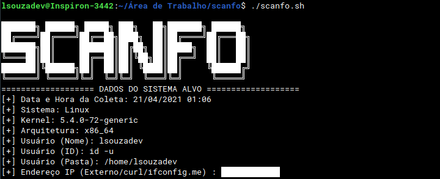

# scanfo
Scanner Forensic for Unix Systems
 
Um scanner forense para sistemas unix para analises de sistemas utilizando um script em bash.

English version is [here](https://github.com/LSouzaDev/scanfo/blob/main/README_en.md)

## Captura de Tela

## Utilização
`./scanfo.sh`

Após a execução um arquivo ***info.txt*** será gerado.

## Que tipo de dado é coletado?
* Qual Sistema está sendo Utilizado
* Versão do Kernel
* Arquitetura do Sistema
* Nome de Usuário
* Localização da Pasta do Usuário
* Endereço IP Externo
* Dispositivos Conectados
* Usuários Conectados
* Conexões de rede
* Lista de Arquivos Abertos
* Processos do Sistema
* Interfaces de rede (ifconfig)
* Registro dos Ultimos Logins
* /etc/passwd
* /etc/groups
* /etc/shadow (root requerido)
* crontab (root/root requerido)
* crontab (usuario)
* Espaço em disco
* Quantidade de Memória RAM
* Binários SUID/SGID
* Verifica RootKits no Sistema

### **ATENÇÃO**
Esse script foi testado no Zorin OS 15.3
